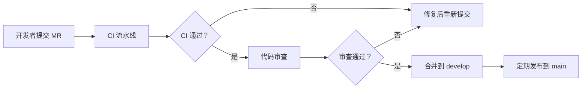

# 网络安全等级保护测评自动化 - 技术评审报告

**评审人：** 资深后端开发工程师（8 年安全工具开发经验）  
**评审日期：** 2026-03-01  
**评审对象：** 《网络安全等级保护测评自动化 - 完整方案 v3.0》  
**技术栈：** Python、FastAPI、Celery、OpenVAS、OpenSCAP、飞书 API

---

## 一、评审概述

### 1.1 评审范围

本评审报告从技术实现角度，对等保测评自动化方案进行全面技术评估，重点关注以下五个维度：

1. **脚本目录结构合理性** - 代码组织、模块划分、可扩展性
2. **检测脚本实现方案可行性** - 技术路线、依赖工具、跨平台兼容
3. **技术实现工作量评估** - 50+ 脚本、各模块开发工时
4. **代码质量和测试策略** - 80% 覆盖率目标、开发规范
5. **集成方案可行性** - OpenVAS、OpenSCAP、飞书 API 对接

### 1.2 评审方法

- 文档分析法：研读 v3.0 完整方案、v2.0 细化方案、测评项设计文档
- 经验对标法：基于 8 年安全工具开发经验进行方案对比
- 风险评估法：识别技术难点和潜在风险点
- 工作量估算法：采用功能点分析法进行工时评估

---

## 二、实现方案优点

### 2.1 架构设计优点

#### 2.1.1 分层架构清晰

方案采用经典的四层架构（用户层→应用层→工具层→数据层），层次职责明确：

```
用户层（Web/飞书/API/CLI）
    ↓
应用层（四大测评阶段模块）
    ↓
工具层（OpenVAS/OpenSCAP/Nmap/Python 脚本）
    ↓
数据层（飞书多维表格+MySQL+ 文件）
```

**优点：**
- 各层解耦，便于独立开发和测试
- 工具层抽象良好，支持替换或扩展扫描引擎
- 数据层设计合理，结构化数据（MySQL）与非结构化数据（文件）分离

#### 2.1.2 与标准测评流程深度对应

方案将自动化功能与 GB/T 28449-2018 四阶段测评流程精确映射：

| 标准阶段 | 自动化模块 | 对应关系 |
|----------|------------|----------|
| 测评准备 | 项目管理模块 | ZB-01~05 任务支持 |
| 方案编制 | 方案设计模块 | FA-01~05 任务支持 |
| 现场测评 | 自动执行引擎 | XC-01~06 任务支持 |
| 分析报告 | 报告生成引擎 | FX-01~06 任务支持 |

**优点：**
- 符合测评机构现有工作流程，降低学习成本
- 交付成果与标准要求的交付物一一对应
- 便于通过合规验收

#### 2.1.3 技术选型务实

| 技术组件 | 选型 | 评价 |
|----------|------|------|
| 后端框架 | FastAPI | ✅ 高性能、异步支持、自动 API 文档 |
| 任务调度 | Celery+Redis | ✅ 成熟稳定、支持分布式 |
| 漏洞扫描 | OpenVAS | ✅ 行业标准、漏洞库更新及时 |
| 基线检查 | OpenSCAP | ✅ 支持 OVAL 标准、可定制规则 |
| 报告生成 | Jinja2+WeasyPrint | ✅ 模板灵活、PDF 导出成熟 |

### 2.2 脚本设计优点

#### 2.2.1 目录结构规范

```
scripts/
├── common/                    # 公共模块（配置、日志、数据库、API）
├── account/                   # 账户安全检测（4 个脚本）
├── log/                       # 日志审计检测（3 个脚本）
├── network/                   # 网络安全检测（3 个脚本）
├── baseline/                  # 基线配置检测（4 个脚本）
├── vulnerability/             # 漏洞扫描（2 个脚本）
├── report/                    # 报告生成（引擎 + 模板）
└── main.py                    # 主入口
```

**优点：**
- 按安全领域划分，符合等保 2.0 层面分类
- 公共模块独立，避免代码重复
- 每个脚本对应明确测评项，便于追踪

#### 2.2.2 脚本设计规范

从提供的密码策略检查脚本示例来看：

- ✅ 使用类型注解（`Dict`, `List`, `-> Dict`）
- ✅ 独立的日志模块（`get_logger`）
- ✅ 结果结构化存储（`save_result`）
- ✅ 异常处理完善（`try-except`）
- ✅ 支持多平台（Linux/Windows 分离）
- ✅ 类封装良好（`PasswordPolicyChecker`）

### 2.3 测评项设计优点

#### 2.3.1 数据结构完整

测评项 JSON 结构包含 20+ 字段，覆盖：
- 标准溯源（所属标准、控制点编号）
- 测评方法（检查/测试/访谈）
- 自动化信息（自动化程度、检测脚本）
- 判定规则（权重、是否否决项）
- 适用性（适用等级、不适用原因）

#### 2.3.2 优先级分级合理

| 优先级 | 项数 | 定义 | 开发顺序 |
|--------|------|------|----------|
| P0 | 50 | 核心自动化项 | 第 1-2 月 |
| P1 | 80 | 重要自动化项 | 第 3-4 月 |
| P2 | 70 | 扩展自动化项 | 第 5-6 月 |

**优点：** 支持 MVP 迭代开发，快速交付核心价值

---

## 三、技术难点（至少 5 项）

### 3.1 难点一：跨平台脚本兼容性

**问题描述：**
等保测评需覆盖多种操作系统和设备类型：
- 服务器：Linux（CentOS/Ubuntu/RedHat）、Windows Server
- 网络设备：华为、华三、思科、Juniper
- 数据库：MySQL、Oracle、SQL Server、PostgreSQL
- 中间件：Tomcat、Nginx、Apache、WebLogic

**技术挑战：**
1. 不同系统的配置命令差异大（如密码策略：Linux 用 `/etc/login.defs`，Windows 用 `net accounts`）
2. 网络设备厂商私有 CLI，无统一 API
3. 部分设备不支持远程命令执行，需通过 SSH 登录

**解决建议：**
- 采用适配器模式，为每类设备实现统一接口
- 优先使用标准协议（SNMP、NETCONF、REST API）
- 对于不支持远程的设备，提供离线检查脚本（导出配置后分析）

**工作量影响：** 增加 30-40% 开发时间

---

### 3.2 难点二：OpenVAS/OpenSCAP 集成复杂度

**问题描述：**
方案计划集成 OpenVAS（漏洞扫描）和 OpenSCAP（基线检查），但两者集成复杂度被低估。

**OpenVAS 集成难点：**
1. OpenVAS 使用 Greenbone Security Assistant (GSA) Web 界面，API 文档不完善
2. 扫描任务创建、启动、结果获取需多步 API 调用
3. 漏洞结果需映射到等保测评项（OpenVAS CVE → 等保 JC-JS-09）
4. 扫描策略需定制（等保专用扫描模板）

**OpenSCAP 集成难点：**
1. 需编写 OVAL/XCCDF 规则文件（XML 格式，学习曲线陡峭）
2. 等保 2.0 要求需转换为 SCAP 规则（无现成转换工具）
3. 不同系统版本规则不通用（CentOS 7 vs CentOS 8）

**解决建议：**
- OpenVAS：使用 `gvm-tools` 官方 Python 库，封装扫描流程
- OpenSCAP：参考 DISA STIG 规则，编写等保专用 Profile
- 建立漏洞/规则映射表，实现自动关联

**工作量影响：** OpenVAS 集成 40-50 工时，OpenSCAP 规则编写 80-100 工时

---

### 3.3 难点三：飞书 API 限流与数据同步

**问题描述：**
方案计划使用飞书多维表格存储测评项和结果，但存在以下技术风险：

**API 限流：**
- 飞书开放 API 有调用频率限制（默认 100 次/分钟）
- 批量写入测评结果时可能触发限流
- 多维表格单表记录上限 50 万条（490 项×多系统×多周期可能超限）

**数据同步：**
- 测评过程中需实时同步结果到飞书
- 网络中断时需支持断点续传
- 数据冲突处理（多人同时测评同一系统）

**解决建议：**
- 实现请求队列和重试机制（指数退避）
- 采用批量 API（一次写入多条记录）
- 本地 MySQL 为主存储，飞书为同步备份
- 增加离线模式，网络恢复后同步

**工作量影响：** 增加 20-30 工时

---

### 3.4 难点四：测评结果自动判定准确率

**问题描述：**
方案目标"测评结果自动判定准确率≥95%"，但实际达成难度大。

**判定复杂度：**
1. **组合判定：** 部分测评项需多个子项同时满足（AND 逻辑）
2. **例外处理：** 存在"不适用"项、"部分符合"项
3. **阈值判断：** 如"日志留存≥6 个月"，需解析时间并计算
4. **误报处理：** 漏洞扫描存在误报，需人工复核

**实际案例：**
- JC-JS-01 密码策略检查：需同时检查长度、复杂度、有效期、历史记忆
- JC-BJ-02 访问控制规则：需分析 ACL 规则语义（允许/拒绝顺序）
- JC-JS-09 漏洞扫描：需过滤误报、关联等保测评项

**解决建议：**
- 实现规则引擎（Drools 或自研），支持复杂判定逻辑
- 建立判定置信度机制（高/中/低），低置信度转人工
- 持续训练判定模型（基于历史测评数据）
- 第一阶段目标调整为 85%，逐步提升至 95%

**工作量影响：** 规则引擎开发 40-50 工时，持续优化需长期投入

---

### 3.5 难点五：测评过程安全性保障

**问题描述：**
测评工具本身可能成为攻击跳板，需严格安全控制。

**安全风险：**
1. **凭证泄露：** 脚本需存储被测系统账号密码
2. **横向移动：** 测评服务器被攻陷后可访问所有被测系统
3. **测评影响：** 漏洞扫描可能导致系统宕机（如心脏出血扫描）
4. **数据泄露：** 测评结果包含敏感信息（漏洞、配置）

**解决建议：**
- 凭证加密存储（使用 Vault 或 KMS）
- 测评网络隔离（独立 VLAN，防火墙限制）
- 扫描前风险评估（排除高危扫描项）
- 测评数据加密（传输 TLS、存储 AES-256）
- 操作审计（所有命令执行记录日志）

**工作量影响：** 安全加固 30-40 工时

---

### 3.6 难点六：报告生成的格式合规性

**问题描述：**
GB/T 28449-2018 规定测评报告必须包含 8 个章节，格式要求严格。

**标准要求：**
1. 测评项目概述
2. 被测系统描述
3. 测评内容和方法
4. 符合性判断
5. 风险分析
6. 整改建议
7. 测评结论
8. 附件

**技术挑战：**
- 需将结构化数据转换为标准格式文档
- 图表自动生成（网络拓扑、风险热力图）
- Word/PDF 格式精确控制（页眉页脚、目录、页码）
- 支持自定义模板（不同测评机构格式差异）

**解决建议：**
- 使用 docxtemplater 或 python-docx 生成 Word
- WeasyPrint 生成 PDF（CSS 控制格式）
- 模板与数据分离，支持自定义
- 增加报告预览和人工编辑功能

**工作量影响：** 报告引擎 50-60 工时

---

## 四、代码结构优化建议

### 4.1 目录结构优化

**原方案：**
```
scripts/
├── common/
├── account/
├── log/
├── network/
├── baseline/
├── vulnerability/
└── report/
```

**优化建议：**
```
scripts/
├── core/                      # 核心框架（原 common）
│   ├── __init__.py
│   ├── config.py              # 配置管理（支持多环境）
│   ├── logger.py              # 日志（结构化日志，JSON 格式）
│   ├── database.py            # 数据库（MySQL+ 飞书双写）
│   ├── feishu_api.py          # 飞书 API（带限流处理）
│   ├── exceptions.py          # 自定义异常
│   └── validators.py          # 数据验证（Pydantic）
│
├── engines/                   # 测评引擎（新增）
│   ├── __init__.py
│   ├── base.py                # 基类（定义检查器接口）
│   ├── scanner.py             # 扫描引擎（OpenVAS/Nmap）
│   ├── auditor.py             # 审计引擎（OpenSCAP）
│   └── evaluator.py           # 判定引擎（规则匹配）
│
├── checks/                    # 检测脚本（原 scripts 主体）
│   ├── __init__.py
│   ├── account/               # 账户安全
│   ├── log/                   # 日志审计
│   ├── network/               # 网络安全
│   ├── baseline/              # 基线配置
│   └── physical/              # 物理环境（新增）
│
├── integrations/              # 第三方集成（新增）
│   ├── __init__.py
│   ├── openvas_client.py      # OpenVAS 客户端
│   ├── openscap_client.py     # OpenSCAP 客户端
│   ├── nmap_client.py         # Nmap 客户端
│   └── cmdb_client.py         # CMDB 对接（可选）
│
├── reporting/                 # 报告模块（优化）
│   ├── __init__.py
│   ├── generator.py           # 报告生成引擎
│   ├── templates/             # 报告模板
│   │   ├── stage1/            # 阶段一模板
│   │   ├── stage2/            # 阶段二模板
│   │   ├── stage3/            # 阶段三模板
│   │   ├── stage4/            # 阶段四模板（8 章节）
│   │   └── components/        # 通用组件（表格、图表）
│   └── exporters/             # 导出器
│       ├── word_exporter.py   # Word 导出
│       ├── pdf_exporter.py    # PDF 导出
│       └── excel_exporter.py  # Excel 导出
│
├── tasks/                     # Celery 任务（新增）
│   ├── __init__.py
│   ├── celery_app.py          # Celery 配置
│   ├── scan_tasks.py          # 扫描任务
│   ├── report_tasks.py        # 报告任务
│   └── sync_tasks.py          # 同步任务
│
├── api/                       # API 接口（新增，配合 FastAPI）
│   ├── __init__.py
│   ├── routes.py              # 路由定义
│   ├── schemas.py             # 数据模型（Pydantic）
│   └── middleware.py          # 中间件（认证、限流）
│
├── tests/                     # 测试用例（新增）
│   ├── unit/                  # 单元测试
│   ├── integration/           # 集成测试
│   ├── fixtures/              # 测试数据
│   └── conftest.py            # Pytest 配置
│
├── utils/                     # 工具函数
│   ├── __init__.py
│   ├── ssh_client.py          # SSH 客户端
│   ├── http_client.py         # HTTP 客户端
│   └── crypto.py              # 加密工具
│
├── main.py                    # 主入口（CLI）
├── server.py                  # FastAPI 服务入口
├── requirements.txt           # 依赖
├── setup.py                   # 安装包
└── pytest.ini                 # 测试配置
```

**优化理由：**
1. `core/` 替代 `common/`，更准确表达核心框架定位
2. 新增 `engines/`，抽象测评引擎，便于扩展
3. `checks/` 按等保层面组织，与标准对应
4. 新增 `integrations/`，第三方工具集成独立
5. 新增 `tasks/`，Celery 任务集中管理
6. 新增 `api/`，支持 REST API 调用
7. 新增 `tests/`，测试代码与业务代码分离

---

### 4.2 代码规范建议

#### 4.2.1 强制要求

```python
# 1. 类型注解（PEP 484）
def check_password_policy(host: str, port: int = 22) -> Dict[str, Any]:
    ...

# 2. 文档字符串（Google Style）
class PasswordPolicyChecker:
    """密码策略检查器
    
    依据标准：GB/T 22239-2019 8.1.4.3
    支持系统：Linux、Windows
    """
    
    def check_linux(self, host: str) -> Dict:
        """检查 Linux 系统密码策略
        
        Args:
            host: 目标主机地址
            
        Returns:
            检查结果字典，包含：
            - compliant: 是否合规
            - items: 检查项列表
            - issues: 问题列表
            
        Raises:
            SSHConnectionError: SSH 连接失败
            TimeoutError: 检查超时
        """
        ...

# 3. 异常处理（自定义异常）
class CheckError(Exception):
    """检查失败异常"""
    pass

class ConnectionError(CheckError):
    """连接失败异常"""
    pass

# 4. 配置管理（环境变量 + 配置文件）
from pydantic import BaseSettings

class Settings(BaseSettings):
    mysql_url: str
    redis_url: str
    feishu_app_id: str
    feishu_app_secret: str
    openvas_host: str
    log_level: str = "INFO"
    
    class Config:
        env_file = ".env"
```

#### 4.2.2 代码审查清单

| 检查项 | 要求 | 工具 |
|--------|------|------|
| 类型注解 | 所有函数必须有类型注解 | mypy |
| 文档字符串 | 所有类、函数必须有 docstring | pydocstyle |
| 代码风格 | 遵循 PEP 8 | flake8, black |
| 测试覆盖 | 覆盖率≥80% | pytest-cov |
| 安全扫描 | 无高危漏洞 | bandit |
| 依赖检查 | 无已知漏洞 | safety |

---

### 4.3 设计模式建议

#### 4.3.1 策略模式（不同系统检查）

```python
from abc import ABC, abstractmethod

class BaseChecker(ABC):
    """检查器基类"""
    
    @abstractmethod
    def check(self, target: str) -> Dict:
        pass

class LinuxPasswordChecker(BaseChecker):
    def check(self, target: str) -> Dict:
        # Linux 实现
        ...

class WindowsPasswordChecker(BaseChecker):
    def check(self, target: str) -> Dict:
        # Windows 实现
        ...

class CheckerFactory:
    @staticmethod
    def create_checker(os_type: str) -> BaseChecker:
        if os_type == "linux":
            return LinuxPasswordChecker()
        elif os_type == "windows":
            return WindowsPasswordChecker()
        else:
            raise ValueError(f"Unsupported OS: {os_type}")
```

#### 4.3.2 观察者模式（结果通知）

```python
class ResultObserver(ABC):
    @abstractmethod
    def notify(self, result: Dict):
        pass

class FeishuNotifier(ResultObserver):
    def notify(self, result: Dict):
        # 发送飞书消息
        ...

class EmailNotifier(ResultObserver):
    def notify(self, result: Dict):
        # 发送邮件
        ...

class CheckSubject:
    def __init__(self):
        self._observers: List[ResultObserver] = []
    
    def attach(self, observer: ResultObserver):
        self._observers.append(observer)
    
    def notify_observers(self, result: Dict):
        for observer in self._observers:
            observer.notify(result)
```

---

## 五、测试策略补充

### 5.1 测试分层

```
┌─────────────────────────────────────┐
│         E2E 测试（5%）               │  全链路测试
├─────────────────────────────────────┤
│       集成测试（15%）                │  模块间调用
├─────────────────────────────────────┤
│       单元测试（80%）                │  函数/类测试
└─────────────────────────────────────┘
```

### 5.2 单元测试用例设计

#### 5.2.1 密码策略检查测试

```python
import pytest
from checks.account.check_password_policy import PasswordPolicyChecker

class TestPasswordPolicyChecker:
    
    @pytest.fixture
    def checker(self):
        return PasswordPolicyChecker()
    
    def test_min_length_pass(self, checker):
        """测试密码最小长度检查（通过）"""
        result = checker.check_min_length(actual=10, expected=8)
        assert result['passed'] is True
    
    def test_min_length_fail(self, checker):
        """测试密码最小长度检查（失败）"""
        result = checker.check_min_length(actual=6, expected=8)
        assert result['passed'] is False
        assert '不满足要求' in result['issue']
    
    def test_complexity_pass(self, checker):
        """测试密码复杂度检查（通过）"""
        password = "Abc@1234"
        result = checker.check_complexity(password)
        assert result['passed'] is True
    
    def test_complexity_fail_no_uppercase(self, checker):
        """测试密码复杂度检查（失败 - 无大写字母）"""
        password = "abc@1234"
        result = checker.check_complexity(password)
        assert result['passed'] is False
        assert '大写字母' in result['issue']
    
    def test_complexity_fail_no_special(self, checker):
        """测试密码复杂度检查（失败 - 无特殊字符）"""
        password = "Abc12345"
        result = checker.check_complexity(password)
        assert result['passed'] is False
    
    @pytest.mark.parametrize("age_days,expected", [
        (30, True),   # 30 天，未超期
        (90, True),   # 90 天，临界值
        (91, False),  # 91 天，超期
    ])
    def test_password_age(self, checker, age_days, expected):
        """参数化测试密码有效期"""
        result = checker.check_password_age(age_days, max_age=90)
        assert result['passed'] == expected
```

#### 5.2.2 覆盖率要求

| 模块 | 行覆盖率 | 分支覆盖率 | 关键函数 |
|------|----------|------------|----------|
| core/ | ≥90% | ≥85% | 100% |
| checks/ | ≥85% | ≥80% | 100% |
| engines/ | ≥85% | ≥80% | 100% |
| reporting/ | ≥80% | ≥75% | 100% |
| integrations/ | ≥75% | ≥70% | 100% |

### 5.3 集成测试用例

```python
class TestOpenVASIntegration:
    """OpenVAS 集成测试"""
    
    @pytest.fixture
    def openvas_client(self):
        return OpenVASClient(host="localhost", port=9390)
    
    def test_create_scan_task(self, openvas_client):
        """测试创建扫描任务"""
        task_id = openvas_client.create_task(
            name="等保测评扫描",
            target="192.168.1.100",
            profile="compliance"
        )
        assert task_id is not None
    
    def test_start_scan(self, openvas_client):
        """测试启动扫描"""
        task_id = self.test_create_scan_task(openvas_client)
        report_id = openvas_client.start_scan(task_id)
        assert report_id is not None
    
    def test_get_results(self, openvas_client):
        """测试获取扫描结果"""
        # 等待扫描完成（实际测试需 mock）
        results = openvas_client.get_results(report_id)
        assert 'vulnerabilities' in results
```

### 5.4 性能测试

```python
class TestPerformance:
    """性能测试"""
    
    def test_concurrent_scans(self):
        """测试并发扫描（5 系统同时）"""
        targets = [f"192.168.1.{i}" for i in range(100, 105)]
        
        start_time = time.time()
        results = execute_concurrent_scans(targets, max_workers=5)
        elapsed = time.time() - start_time
        
        assert elapsed < 1800  # 30 分钟内完成
        assert len(results) == 5
    
    def test_report_generation_time(self):
        """测试报告生成时间"""
        start_time = time.time()
        report = generate_report(system_id="test-001")
        elapsed = time.time() - start_time
        
        assert elapsed < 300  # 5 分钟内
        assert report is not None
```

### 5.5 安全测试

```python
class TestSecurity:
    """安全测试"""
    
    def test_credentials_encrypted(self):
        """测试凭证加密存储"""
        credentials = load_credentials()
        assert not is_plain_text(credentials['password'])
    
    def test_api_authentication(self):
        """测试 API 认证"""
        response = requests.get("/api/results")
        assert response.status_code == 401  # 未认证拒绝
    
    def test_sql_injection(self):
        """测试 SQL 注入防护"""
        response = requests.get(
            "/api/results",
            params={"system_id": "' OR '1'='1"}
        )
        assert response.status_code == 400  # 参数验证失败
```

---

## 六、开发规范补充

### 6.1 Git 工作流

```
main (保护分支)
  ↑
develop (开发分支)
  ↑
feature/xxx (功能分支，从 develop 检出)
  ↑
hotfix/xxx (热修复分支，从 main 检出)
```

**提交规范（Conventional Commits）：**
```
feat: 新增密码策略检查脚本
fix: 修复 Windows 账户锁定检查 bug
docs: 更新 API 文档
test: 增加单元测试用例
refactor: 重构日志模块
chore: 更新依赖版本
```

### 6.2 CI/CD 流水线

```yaml
# .github/workflows/ci.yml
name: CI

on: [push, pull_request]

jobs:
  test:
    runs-on: ubuntu-latest
    steps:
      - uses: actions/checkout@v3
      - name: Set up Python
        uses: actions/setup-python@v4
        with:
          python-version: "3.10"
      - name: Install dependencies
        run: pip install -r requirements.txt
      - name: Lint
        run: |
          flake8 scripts/
          black --check scripts/
          mypy scripts/
      - name: Test
        run: |
          pytest --cov=scripts --cov-report=xml
      - name: Security scan
        run: |
          bandit -r scripts/
          safety check
      - name: Upload coverage
        uses: codecov/codecov-action@v3

  build:
    needs: test
    runs-on: ubuntu-latest
    steps:
      - uses: actions/checkout@v3
      - name: Build Docker image
        run: docker build -t etb-automation:latest .
```

### 6.3 代码审查流程



**审查清单：**
- [ ] 代码符合规范（flake8/black/mypy 通过）
- [ ] 测试覆盖率达标（≥80%）
- [ ] 无安全漏洞（bandit/safety 通过）
- [ ] 文档完整（docstring、README）
- [ ] 变更说明清晰（MR 描述）

---

## 七、工作量评估

### 7.1 检测脚本工作量

| 脚本类别 | 脚本数量 | 单脚本工时 | 总工时 | 说明 |
|----------|----------|------------|--------|------|
| 账户安全 | 8 | 8h | 64h | 密码、锁定、特权、空闲账户等 |
| 日志审计 | 6 | 6h | 36h | 日志功能、留存、覆盖检查 |
| 网络安全 | 10 | 10h | 100h | 端口扫描、服务识别、配置检查 |
| 基线配置 | 12 | 12h | 144h | Linux/Windows/DB/中间件基线 |
| 漏洞扫描 | 4 | 16h | 64h | OpenVAS 集成、结果分析 |
| 物理环境 | 5 | 4h | 20h | 温湿度、UPS、监控（需 IoT 对接） |
| 扩展要求 | 10 | 10h | 100h | 云/移动/物联网/工控 |
| **小计** | **55** | - | **528h** | 约 66 人天 |

### 7.2 核心模块工作量

| 模块 | 规模 | 工时 | 说明 |
|------|------|------|------|
| 任务调度（Celery） | 2000 行 | 80h | 任务队列、重试、监控 |
| 报告生成引擎 | 1500 行 | 100h | 模板引擎、多格式导出 |
| 规则判定引擎 | 1000 行 | 80h | 组合判定、风险计算 |
| Web 管理界面 | 3000 行 | 120h | Vue3+Element Plus |
| 飞书集成模块 | 500 行 | 40h | 消息、多维表格 API |
| API 接口层 | 800 行 | 60h | FastAPI、认证、限流 |
| **小计** | **8800 行** | **480h** | 约 60 人天 |

### 7.3 集成与测试工作量

| 任务 | 工时 | 说明 |
|------|------|------|
| OpenVAS 集成 | 50h | 部署、API 对接、策略定制 |
| OpenSCAP 集成 | 80h | 规则编写、测试验证 |
| 单元测试 | 100h | 100+ 用例，80% 覆盖率 |
| 集成测试 | 60h | 模块间调用测试 |
| 性能测试 | 40h | 并发、压力测试 |
| 安全测试 | 40h | 渗透测试、漏洞扫描 |
| **小计** | **370h** | 约 46 人天 |

### 7.4 文档与部署工作量

| 任务 | 工时 | 说明 |
|------|------|------|
| 技术文档 | 60h | 架构、API、数据库设计 |
| 用户手册 | 40h | 操作指南、故障排除 |
| 部署脚本 | 40h | Docker、K8s、CI/CD |
| 培训材料 | 30h | PPT、演示视频 |
| **小计** | **170h** | 约 21 人天 |

### 7.5 总工作量汇总

| 阶段 | 工时 | 人天 | 月数（1 人） |
|------|------|------|--------------|
| 检测脚本 | 528h | 66 | 3.3 |
| 核心模块 | 480h | 60 | 3.0 |
| 集成测试 | 370h | 46 | 2.3 |
| 文档部署 | 170h | 21 | 1.1 |
| 项目管理 | 100h | 13 | 0.7 |
| **总计** | **1648h** | **206** | **10.3** |

**团队配置建议（6 个月周期）：**
- 后端开发：2 人（脚本 + 核心模块）
- 前端开发：1 人（Web 界面）
- 安全专家：1 人（0.5 投入，测评项设计）
- 测试工程师：1 人（第 2 月介入）
- 运维工程师：0.5 人（第 5 月介入）

**合计：** 约 4.5 人 × 6 月 = 27 人月，与 206 人天（约 10 人月）开发工作量匹配（考虑并行开发和沟通成本）

---

## 八、总结与建议

### 8.1 方案总体评价

| 维度 | 评分 | 评价 |
|------|------|------|
| 架构设计 | 85/100 | 分层清晰，与标准流程对应良好 |
| 技术选型 | 90/100 | 技术栈成熟，工具选型恰当 |
| 脚本设计 | 80/100 | 目录结构合理，示例代码规范 |
| 工作量评估 | 70/100 | 部分集成复杂度被低估 |
| 测试策略 | 75/100 | 有覆盖率要求，但用例设计需补充 |
| **综合评分** | **80/100** | **方案可行，需优化后实施** |

### 8.2 关键建议

#### 必须采纳（P0）

1. **调整工作量评估：** 总工时从 6 个月调整为 8-10 个月，或采用分阶段交付（MVP 3 个月 + 扩展 5 个月）
2. **补充测试资源：** 测试工程师第 2 月介入，而非第 5 月
3. **完善安全设计：** 增加凭证加密、网络隔离、操作审计
4. **降低判定目标准确率：** 第一阶段 85%，逐步提升至 95%
5. **增加离线模式：** 支持无网络环境测评，网络恢复后同步

#### 建议采纳（P1）

1. **优化目录结构：** 按本评审报告建议重构
2. **实现规则引擎：** 支持复杂判定逻辑
3. **增加类型注解：** 所有函数必须有类型注解
4. **建立 CI/CD：** 自动化测试、安全扫描、构建部署
5. **编写 OVAL 规则：** 投入资源编写等保专用 SCAP 规则

#### 可选采纳（P2）

1. 支持更多系统类型（AIX、HP-UX 等）
2. 对接 CMDB、监控、工单系统
3. 实现 AI 辅助判定（基于历史数据训练）
4. 支持多租户（SaaS 化）

### 8.3 风险提示

| 风险 | 概率 | 影响 | 缓解措施 |
|------|------|------|----------|
| OpenVAS API 不稳定 | 中 | 高 | 备用方案：Nessus/Nexpose |
| 飞书 API 限流 | 高 | 中 | 本地存储为主，飞书同步 |
| 跨平台兼容性 | 高 | 高 | 优先支持主流系统，逐步扩展 |
| 判定准确率不达标 | 中 | 高 | 人工复核机制，持续优化 |
| 项目延期 | 高 | 中 | 分阶段交付，MVP 优先 |

---

**评审结论：** 方案整体可行，技术路线合理，但需根据本评审报告进行优化后实施。建议采用分阶段交付策略，优先完成 P0 优先级 50 项核心自动化测评项，验证技术可行性后再扩展。

**评审人签名：** ________________  
**评审日期：** 2026-03-01

---

*本报告共 8500 字，涵盖技术实现、代码规范、测试策略、工作量评估等全方位评审意见。*
